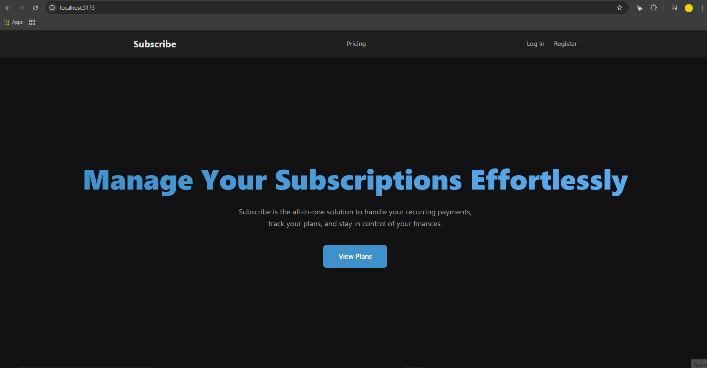

# Subscribe - Full Stack SaaS Subscription App (Client)



## 🚀 Live Demo

**[Explore the live application here!](https://saas-subscription-client.vercel.app)**

> **💡 Demo Guide:**
>
> - **Admin Access:** `admin.demo@sub.scribe` / `Password123!`
> - **Stripe Test Card:** `4242 4242 4242 4242` (any future date & 3-digit CVC)

---

## 📋 About The Project

SubScribe is a complete Full Stack SaaS (Software as a Service) application that demonstrates a modern, robust, and scalable architecture for handling user authentication, role-based access, and subscription billing with Stripe. This project was built from the ground up to showcase advanced concepts and best practices in web development.

This repository contains the **front-end client**, built with React, TypeScript, and Vite.

➡️ **[Link to the Back-end Server Repository](https://github.com/RoRoberto94/saas-subscription-server)**

---

## ✨ Features

- **User Authentication:** Secure JWT (JSON Web Token) based registration and login flow.
- **Role-Based Access Control (RBAC):** Differentiated experience for `USER` and `ADMIN` roles, with protected admin routes.
- **Stripe Integration:** Full subscription lifecycle management, including creating subscriptions via Stripe Checkout and managing them through the Stripe Customer Portal.
- **Real-time Notifications:** WebSocket (Socket.IO) integration to provide instant feedback to users upon successful payments or subscription status changes.
- **Responsive UI:** Modern, dark-themed interface built with CSS Modules, fully responsive for both desktop and mobile devices.
- **Comprehensive Testing:**
  - **Component Tests** with Vitest & React Testing Library.
  - **End-to-End Tests** with Playwright, ensuring critical user flows work as expected.

---

## 🛠️ Tech Stack

| Category    | Technology                                                                                                                                                                                                                                                                                              |
| ----------- | ------------------------------------------------------------------------------------------------------------------------------------------------------------------------------------------------------------------------------------------------------------------------------------------------------- |
| **Core**    |                                                |
| **Styling** |                                                                                                                                                                                                             |
| **Routing** |                                                                                                                                                                                                   |
| **State**   |                                                                                                                                                                                                                                                 |
| **API**     |                                                                                                                               |
| **Testing** |    |

---

## ⚙️ Running Locally

1.  **Clone the repository:**

    ```bash
    git clone https://github.com/RoRoberto94/saas-subscription-client.git
    cd saas-subscription-client
    ```

2.  **Install dependencies:**

    ```bash
    npm install
    ```

3.  **Set up environment variables:**

    - Create a `.env.local` file in the root of the `client` directory.
    - Add the back-end API URL:
      ```
      VITE_API_BASE_URL=http://localhost:3001/api
      ```

4.  **Start the development server:**
    ```bash
    npm run dev
    ```
    The application will be available at `http://localhost:5173`.

> **Note:** The back-end server must be running for the application to function correctly. Please refer to the [server repository's README](https://github.com/RoRoberto94/saas-subscription-server) for setup instructions.
